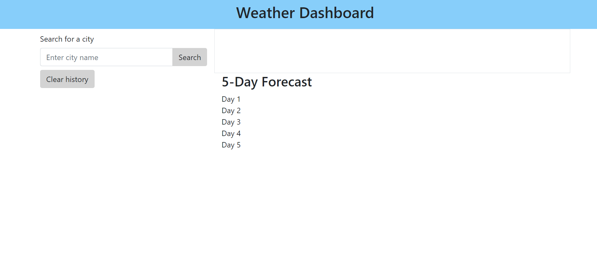
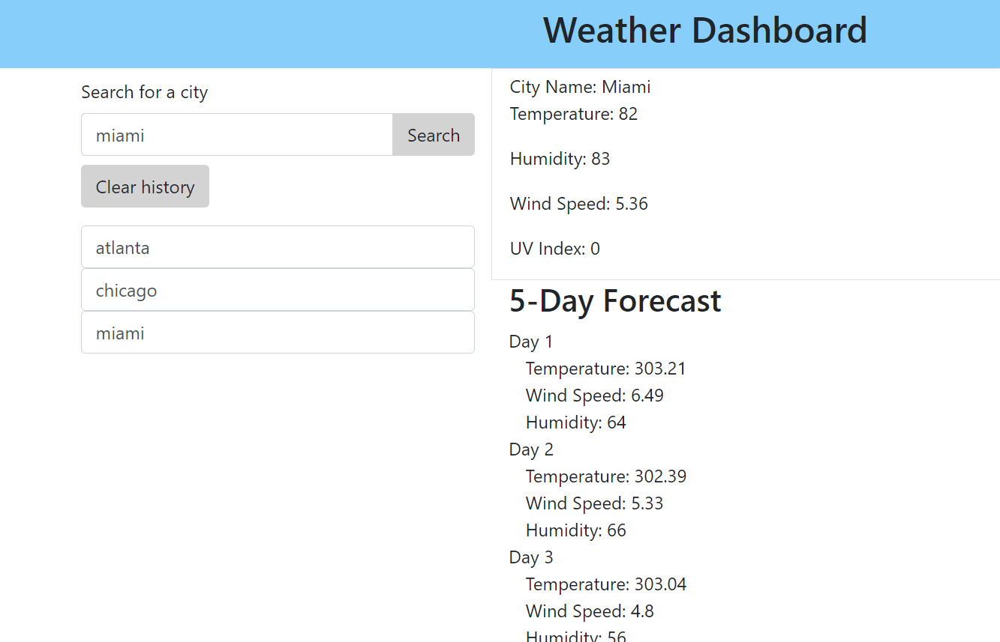

# <WEATHER-DASHBOARD>

## Description
Look up any city in America to view today's weather plus a 5-day forecast! Cities will be saved when they are searched and you are able to clear your history if you would like. 

## Table of Contents (Optional)
- [Installation](#installation)
- [Usage](#usage)
- [Credits](#credits)
- [License](#license)

## Installation
Wrote the HTML and CSS to create the elements that the data from the API information pulled would display. Made the elements that were to be used linked to Javascript with variables using JQUery. Pulled the One Call API to receive the information for the current weather and selected which information we want to be displayed on our Weather Dashboard. To get the UV index API called needed the lat and lon first then used in the second API call pull UV Index based on latitude and longitude. Then added the local storage and included the city input to be added to local storage when it was searched. Once previously searched cities were populating created the clear history function so previously searched cities will be removed once the page is refreshed. 

## Usage

## Credits
TA, class hours, and tutoring were all used in completing this assignment and I needed every one of their help! 

## License
MIT License

Copyright (c) [2021] [matthewflanagan]

Permission is hereby granted, free of charge, to any person obtaining a copy
of this software and associated documentation files (the "Software"), to deal
in the Software without restriction, including without limitation the rights
to use, copy, modify, merge, publish, distribute, sublicense, and/or sell
copies of the Software, and to permit persons to whom the Software is
furnished to do so, subject to the following conditions:

The above copyright notice and this permission notice shall be included in all
copies or substantial portions of the Software.

THE SOFTWARE IS PROVIDED "AS IS", WITHOUT WARRANTY OF ANY KIND, EXPRESS OR
IMPLIED, INCLUDING BUT NOT LIMITED TO THE WARRANTIES OF MERCHANTABILITY,
FITNESS FOR A PARTICULAR PURPOSE AND NONINFRINGEMENT. IN NO EVENT SHALL THE
AUTHORS OR COPYRIGHT HOLDERS BE LIABLE FOR ANY CLAIM, DAMAGES OR OTHER
LIABILITY, WHETHER IN AN ACTION OF CONTRACT, TORT OR OTHERWISE, ARISING FROM,
OUT OF OR IN CONNECTION WITH THE SOFTWARE OR THE USE OR OTHER DEALINGS IN THE
SOFTWARE.

## Features
Find the current temperature, humidty, wind speed, and UV Index for any city in the world! A 5 day forecast showing temperature, wind speed, and humidity will also be displayed below the current weather. Keep a history of the cities searched and have the option to clear the history as well. 

## How to Contribute
If you created an application or package and would like other developers to contribute it, you can include guidelines for how to do so. The [Contributor Covenant](https://www.contributor-covenant.org/) is an industry standard, but you can always write your own if you'd prefer.